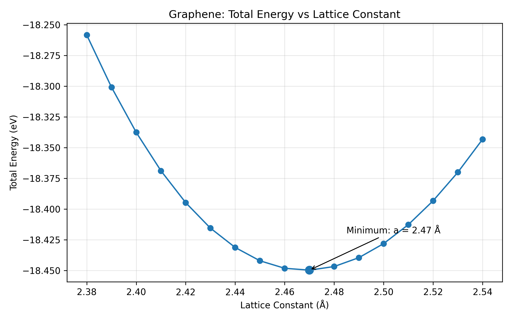
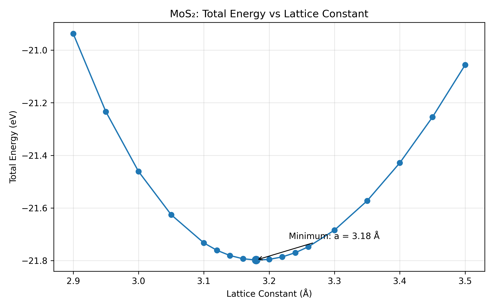
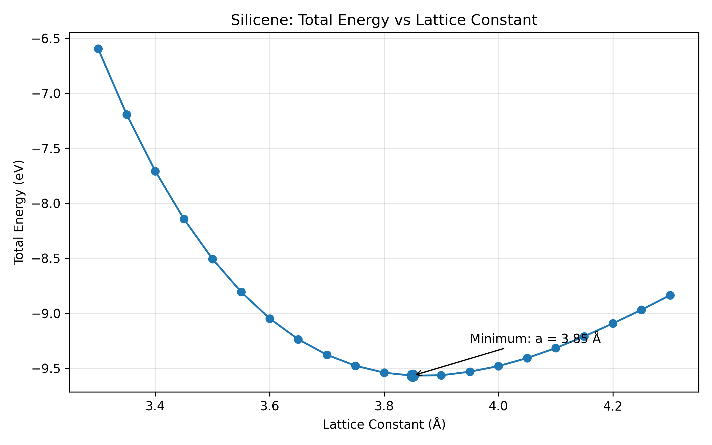
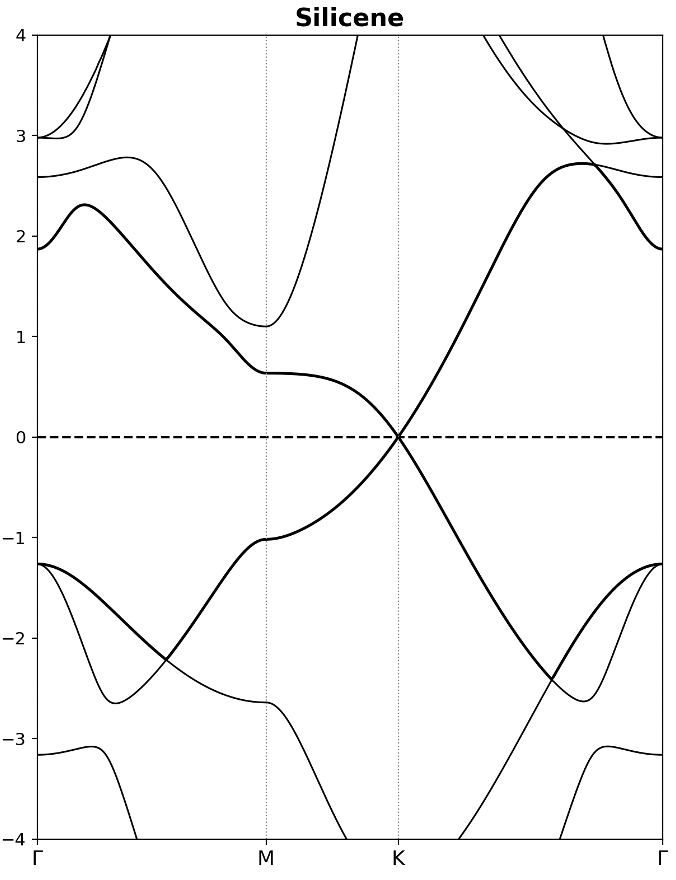
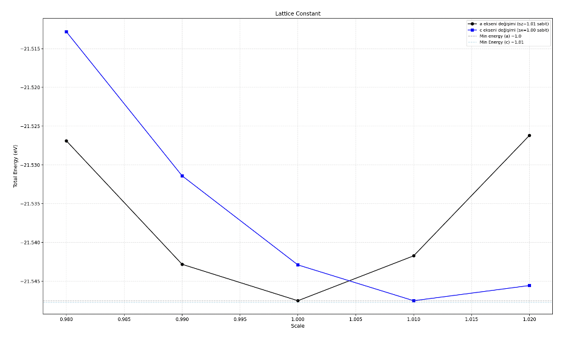
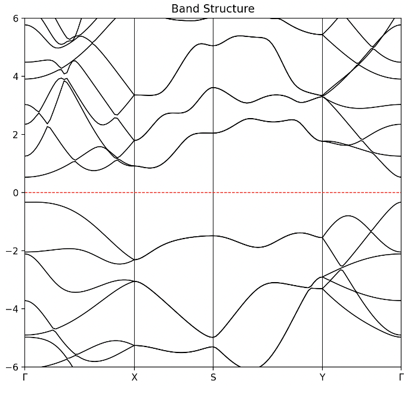

# 2D Materials DFT Study

Density Functional Theory (DFT) study of graphene, MoS₂, silicene, and phosphorene using VASP.

This repository documents structural and electronic-property analyses performed during a computational materials science project.

## Materials

- Graphene
- MoS₂
- Silicene
- Phosphorene

## Computational Workflow

The project involved:

- Plane-wave cutoff energy (ENCUT) convergence tests
- k-point convergence tests
- Vacuum-distance convergence tests for 2D systems
- Geometry optimization
- Lattice-constant determination from total-energy calculations
- Bond-length and bond-angle analysis
- Cohesive-energy calculations
- Electronic band-structure analysis
- Visualization and post-processing using Python and VESTA

## Graphene

### Lattice Constant Calculation

The equilibrium lattice constant was determined by calculating the total energy of graphene for different lattice parameters.

Calculated equilibrium lattice constant:

**a = 2.47 Å**

Minimum calculated total energy:

**E = -18.44973471 eV**



The calculated lattice constant is consistent with reported literature values of approximately 2.46–2.47 Å.

### Convergence Parameters

The selected calculation parameters were:

- ENCUT: 500 eV
- k-point mesh: 18 × 18 × 1
- Vacuum distance: 15 Å

### Structural Properties

| Property | Calculated |
|---|---:|
| Lattice constant | 2.47 Å |
| C-C bond length | 1.426 Å |
| Bond angle | 120° |
| Cohesive energy | -7.8547 eV/atom |


## MoS₂

### Lattice Constant Calculation

The equilibrium lattice constant of monolayer MoS₂ was determined by calculating the total energy for different lattice parameters.

Calculated equilibrium lattice constant:

**a = 3.18 Å**

Minimum calculated total energy:

**E = -21.797814 eV**



The calculated lattice constant is consistent with literature values reported in the range of approximately 3.16–3.20 Å.

### Convergence Parameters

The selected calculation parameters were:

- ENCUT: 600 eV
- k-point mesh: 9 × 9 × 1
- Vacuum distance: 18 Å

### Structural Properties

| Property | Calculated |
|---|---:|
| Lattice constant | 3.18 Å |
| Mo-S bond length | 2.412 Å |
| S-S distance | 3.129 Å |
| S-Mo-S bond angle | 80.87° |
| Cohesive energy | -5.18 eV/atom |


## Silicene

### Lattice Constant Calculation

The equilibrium lattice constant of silicene was determined by calculating the total energy for different lattice parameters.

Calculated equilibrium lattice constant:

**a = 3.85 Å**

Minimum calculated total energy:

**E = -9.56836669 eV**



The calculated lattice constant is consistent with the reported literature value of approximately 3.86 Å.

### Convergence Parameters

The selected calculation parameters were:

- ENCUT: 600 eV
- k-point mesh: 12 × 12 × 1
- Vacuum distance: 18 Å

### Structural Properties

| Property | Calculated |
|---|---:|
| Lattice constant | 3.85 Å |
| Si-Si bond length | 2.277 Å |
| Bond angle | 116.32° |
| Cohesive energy | -3.97 eV/atom |

### Electronic Band Structure

The electronic band structure of silicene was calculated along selected high-symmetry directions.



### Reference

Cahangirov, S., Topsakal, M., Aktürk, E., Şahin, H., & Ciraci, S.  
*Two- and One-Dimensional Honeycomb Structures of Silicon and Germanium.*  
Physical Review Letters, 102, 236804 (2009).


## Phosphorene

### Lattice Parameter Analysis

Unlike hexagonal 2D materials such as graphene and MoS₂, phosphorene has an anisotropic structure characterized by two different in-plane lattice parameters.

The lattice parameters were determined by varying the structural scale factors and monitoring the total energy.



The minimum-energy configurations corresponded approximately to scale factors of:

- 1.00 along one lattice direction
- 1.01 along the second lattice direction

Using the initial lattice parameters, the optimized lattice constants were obtained as:

**a = 3.29 Å**

**b = 4.58 Å**

### Convergence Parameters

The selected calculation parameters were:

- ENCUT: 400 eV
- k-point mesh: 12 × 12 × 1
- Vacuum distance: 16 Å

### Structural Properties

| Property | Calculated |
|---|---:|
| Lattice constant a | 3.29 Å |
| Lattice constant b | 4.58 Å |
| P-P bond length | 2.20 Å |
| Bond angle | 96.73° |
| Cohesive energy | 3.4998 eV/atom |

### Electronic Band Structure

The electronic band structure was calculated along the high-symmetry path:

**Γ – X – S – Y – Γ**



The calculated band gap was approximately:

**Eg ≈ 0.86 eV**

### Reference

Liu, H., Neal, A. T., Zhu, Z., Luo, Z., Xu, X., Tománek, D., & Ye, P. D.  
*Phosphorene: An Unexplored 2D Semiconductor with a High Hole Mobility.*  
ACS Nano, 8(4), 4033–4041 (2014).


## Repository Structure

```text
2D-Materials-DFT-Study/
├── data/
│   ├── graphene/
│   ├── mos2/
│   ├── silicene/
│   └── phosphorene/
├── figures/
├── scripts/
├── references/
└── README.md

Data Availability
The original calculations were performed using VASP on an HPC system during a research internship.
The original raw VASP input and output files are currently unavailable. Therefore, this repository contains preserved numerical results, reconstructed data tables, analysis scripts, figures, and literature comparisons derived from the original project records.
No third-party VASP input or output files are presented as original calculation files.


Tools
VASP
Python
pandas
Matplotlib
VESTA


Author
Yağız Özmen
Physics Engineering, Ankara University

